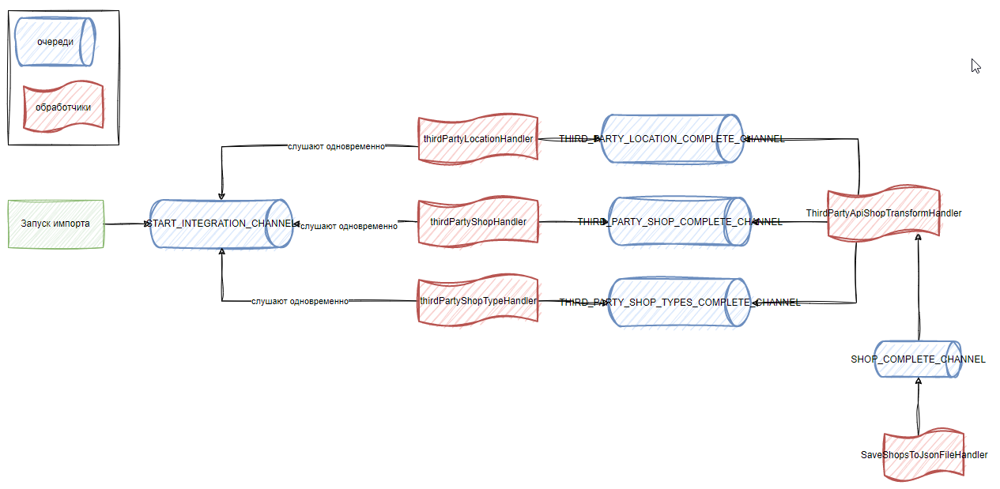

# Изучение spring integration

## Легенда

### Дано

Есть 3 сторонних REST API, которые возвращают исходные данные:

1. Локации
1. Магазины
1. Типы магазинов

Для простоты - реализованы внутри нашего приложения:
[ru.ezhov.learn.spring.integration.thirdpartyapi.ThirdPartyClientRestController](src/main/kotlin/ru/ezhov/learn/spring/integration/thirdpartyapi/ThirdPartyClientRestController.kt)

### Необходимо

1. Запускать получение данных асинхронно
1. Иметь возможность обрабатывать полученные данные в разных обработчиках
1. Иметь возможность добавлять новых подписчиков
1. Иметь возможность трансформировать данные из трёх каналов и регистрировать их в один канал
1. Обрабатывать итоговые данные

### Решение

1. Создадим REST API нашего приложения для запуска
   интеграции [ru.ezhov.learn.spring.integration.app.interfaces.rest.api.IntegrationRestController.startIntegration](src/main/kotlin/ru/ezhov/learn/spring/integration/app/interfaces/rest/api/IntegrationRestController.kt)
1. Создадим несколько
   каналов [ru.ezhov.learn.spring.integration.app.config.ChannelConfig](src/main/kotlin/ru/ezhov/learn/spring/integration/app/config/ChannelConfig.kt)
1. Создадим несколько
   обработчиков [ru.ezhov.learn.spring.integration.app.config.HandlerConfig](src/main/kotlin/ru/ezhov/learn/spring/integration/app/config/HandlerConfig.kt)
1. Настроим
   связи [ru.ezhov.learn.spring.integration.app.config.FlowConfig](src/main/kotlin/ru/ezhov/learn/spring/integration/app/config/FlowConfig.kt)

#### Схема

[DRAWIO](концепция-интеграции.drawio)

